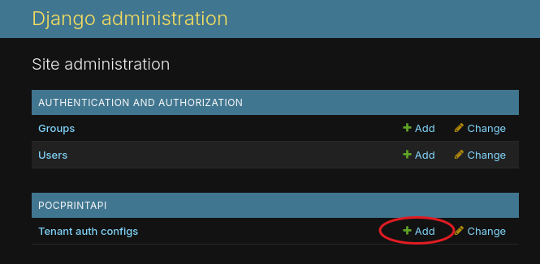
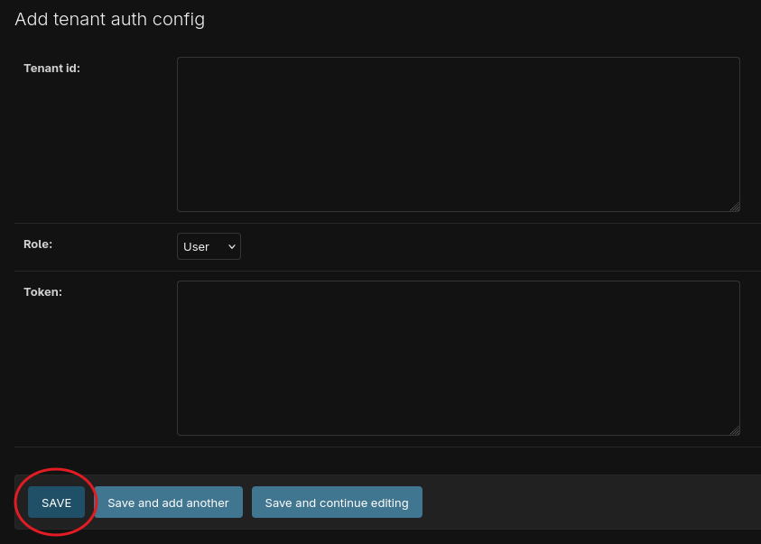

# poc_print_hub

Simple, yet robust self-hosted solution for delivering messages/notifications via a network printer. Its primary intended use is, but not limited to, serving as a notification sink for a homelab infrastructure, receiving and printing notifications in the privacy of a local network.


## poc-print-api

Web-API + Admin page, enables print message publishing and processing, tenant authentication, as well as printer communication and function control via the network (get status, feed paper, cut paper, etc.).

### Endpoints

| Verb | Url | Allowed Tenant Roles | Notes |
|---|---|---|---|
| `POST` | `api/queues/publish` | ADMIN, USER | Publishes messages for printing |
| `POST` | `api/queues/republish` | ADMIN | Republishes all messages from the `error` queue to the `print` queue |
| `GET` | `api/queues/status` | ADMIN | Returns `print` and `error` queue statuses: `isOnline` and `count` |
| `GET` | `api/printer/status` | ADMIN | Returns printer status: `name`, `isOnline`, and `paperStatus` |
| `POST` | `api/printer/feed` | ADMIN | Feeds printer paper `n_times` |
| `POST` | `api/printer/cut` | ADMIN | Cuts paper (feeds `n*6` times, then cuts) |
| `POST` | `api/tenant/role` | ADMIN, USER | Returns tenant role: `tenantId` and `role` |

Request examples [here](src/api/pocprintapi_queries/queries.md). Note that requests include the following headers: `PPH-Tenant-Id` and `PPH-Tenant-Token`. These are required for tenant-based auth, if it is enabled (`POC_PRINT_HUB_TENANT_AUTH_ENABLED: True`). Ensure test tenant entries are created before using the queries (best done via the `Admin` page; instructions below):

| Tenant Id | Tenant Token | Role |
|---|---|---|
| `admin-test-id` | `admin-test-token` | ADMIN |
| `user-test-id` | `user-test-token` | USER |

### Tech stack

- [Django 5](https://docs.djangoproject.com/en/6.0/releases/5.0/)
- [Celery](https://docs.celeryq.dev/en/v5.5.3/django/first-steps-with-django.html) + [Celery Beat](https://docs.celeryq.dev/en/main/userguide/periodic-tasks.html) for task scheduling
- [WhiteNoise](https://whitenoise.readthedocs.io/en/stable/django.html) for static file serving
- [Gunicorn](https://gunicorn.org/) as WSGI server
- [PostgreSQL](https://www.postgresql.org/docs/)
- [RabbitMQ](https://www.rabbitmq.com/docs)

### Configuration

#### Environment variables

| Name | Default Value | Notes |
|---|---|---|
| SECRET_KEY | `by-using-default-secrets-I-am-running-away-from-my-responsibilities-and-it-feels-good` | `string` Make sure to generate your own, instructions below |
| DEBUG | `False` | `bool` |
| POC_PRINT_HUB_TENANT_AUTH_ENABLED | `True` | `bool` If enabled, consider setting up a super user for convenience. Instructions on that and how to use the auth below |
| POC_PRINT_HUB_RABBIT_MQ_HOST | - | `string` |
| POC_PRINT_HUB_RABBIT_MQ_USERNAME | - | `string` |
| POC_PRINT_HUB_RABBIT_MQ_PASSWORD | - | `string` |
| POC_PRINT_HUB_RABBIT_MQ_QUEUE_NAME | `poc_print_hub` | `string` |
| POC_PRINT_HUB_RABBIT_MQ_QUEUE_DURABLE | `True` | `bool` |
| POC_PRINT_HUB_RABBIT_MQ_QUEUE_BATCH_SIZE | `10` | `int` |
| POC_PRINT_HUB_RABBIT_MQ_DEAD_QUEUE_NAME | `poc_print_hub_dead_letter` | `string` |
| POC_PRINT_HUB_RABBIT_MQ_DEAD_QUEUE_DURABLE | `True` | `bool` |
| POC_PRINT_HUB_QUEUE_SCHEDULE_SEC | `5.0` | `float` |
| POC_PRINT_HUB_QUEUE_MAX_RETRIES | `3` | `int` |
| POC_PRINT_HUB_QUEUE_RETRY_DELAY_SEC | `3` | `int` |
| POC_PRINT_HUB_QUEUE_TIME_LIMIT_SEC | `300` | `int` |
| POC_PRINT_HUB_PRINTER_HOST | - | `string` |
| POC_PRINT_HUB_PRINTER_MESSAGE_SEPARATOR | `----------` | `string` Defines a piece of text that separates messages on paper |
| POC_PRINT_HUB_PRINTER_CHECK_PAPER_STATUS | `True` | `bool` If enabled, the printer's paper status is taken into account when checking for an adequate amount of paper before printing. Otherwise, messages will be sent to be printed regardless of the paper status |
| ALLOWED_HOSTS | `localhost` | `string` Comma-separated list (e.g., `IP1,IP2`). If not hosted on `localhost`, ensure your server's IP is included (use `127.0.0.1` + optionally, your server IP for Docker hosting) |
| CORS_ALLOWED_ORIGINS | `http://localhost:4200` | `string` Comma-separated list (e.g., `IP1,IP2`). `http://localhost:4200` is the default `poc-print-ui` IP and port. If not hosted on `localhost`, ensure your IP is included |

#### How to generate a custom SECRET_KEY value

Code:

```python
import os
import base64

new_key = base64.urlsafe_b64encode(os.urandom(64))
print(new_key)
```

Python shell:

```shell
python -c "import os; import base64; new_key = base64.urlsafe_b64encode(os.urandom(64)); print(new_key)"
```

## poc-print-ui


### Tech stack

- [Angular 20](https://v20.angular.dev/overview#develop-applications-faster-than-ever)
- [DaisyUI](https://daisyui.com/docs/intro/) / [Tailwind CSS](https://tailwindcss.com/docs/installation/using-vite)
- [Nginx](https://nginx.org/en/docs/)

### Configuration

#### Environment variables

| Name | Default Value | Notes |
|---|---|---|
| ENV_PROD | - | Should be `true` for Docker hosting |
| ENV_API_URL | - | `http://127.0.0.1:8000/api` for running locally |
| ENV_TENANT_ID_HEADER | - | Has to be `Pph-Tenant-Id` |
| ENV_TENANT_TOKEN_HEADER | - | Has to be `Pph-Tenant-Token` |
| ENV_MESSAGE_ORIGIN_NAME | - | Defines message origin that will be presented as part of printed messages. For example, `print-hub-web-ui` |

## poc-print-cli

```python
raise NotImplementedError("Coming soon...")
```

## Deployment instructions

### Prerequisites
- [Docker](https://docs.docker.com/engine/install/) + [Docker Compose](https://docs.docker.com/compose/install/).
- [PostgreSQL](https://www.postgresql.org/download/) instance: if not hosted on `localhost`, make sure to configure the engine to accept external requests.
- [RabbitMQ](https://www.rabbitmq.com/docs/download) cluster.
- LAN-enabled POC Thermal Printer: ideally with a static IP; this solution was developed against and tested on [Rongta RP326](https://www.rongtatech.com/rp326-80mm-thermal-printer-for-receipt-printing_p68.html); the list of supported makes and models [here](https://python-escpos.readthedocs.io/en/latest/printer_profiles/available-profiles.html).

### Deployment

The following instructions were tested against a `Debian "bookworm"` server instance, but should work for `Debian`-based distros without changes and for `MacOS` and `Windows` with minor adjustments.

#### Pure Docker

Navigate to [docker-compose.yml](src/docker-compose.yml), populate values for the environment variables, then run:

```shell
sudo docker compose up --build --detach
```

Navigate to:
- `http://127.0.0.1:8000/admin/` to access the Web-API Admin page.
- `http://127.0.0.1:8080/` to access the PrintHub UI page.

#### Docker via Portainer

For extra convenience, we can use [Portainer](https://www.portainer.io/). Make sure you have it [deployed](https://docs.portainer.io/start/install-ce/server/docker/linux#docker-compose) before proceeding.

Navigate to [docker-compose.yml](src/docker-compose.yml) and run:
```shell
sudo docker compose build
```

Now, in the `Portainer` interface navigate to Stacks and deploy a new stack with the following configuration via the `Web Editor` after populating environment variable values:

```yml
services:
  frontend:
    image: printhub-ui:latest
    command: bash -c "
        envsubst < /usr/share/nginx/html/assets/env.template.js > /usr/share/nginx/html/assets/env.js
        && exec nginx -c /etc/nginx/nginx.conf -g 'daemon off;'
      "
    container_name: printhub-web-ui
    restart: unless-stopped
    ports:
      - "8080:8080"
    environment:
      - ENV_PROD=true
      - ENV_API_URL=http://127.0.0.1:8000/api
      - ENV_TENANT_ID_HEADER=Pph-Tenant-Id
      - ENV_TENANT_TOKEN_HEADER=Pph-Tenant-Token
      - ENV_MESSAGE_ORIGIN_NAME=print-hub-web-ui
  backend:
    image: printhub-api:latest
    command: bash -c "
        python manage.py migrate
        && python manage.py collectstatic --noinput
        && gunicorn --bind 0.0.0.0:8000 --workers 3 pocprintapi.wsgi:application
      "
    container_name: printhub-api
    restart: unless-stopped
    ports:
      - "8000:8000"
    environment:
      - POC_PRINT_HUB_RABBIT_MQ_HOST=
      - POC_PRINT_HUB_RABBIT_MQ_USERNAME=
      - POC_PRINT_HUB_RABBIT_MQ_PASSWORD=
      - POC_PRINT_HUB_PRINTER_HOST=
      - DATABASES_POSTGRESQL_USER=
      - DATABASES_POSTGRESQL_PASSWORD=
      - DATABASES_POSTGRESQL_HOST=
      - DJANGO_ALLOWED_HOSTS=127.0.0.1	            # comma-separated for multiple
      - CORS_ALLOWED_ORIGINS=http://localhost:8080	# comma-separated for multiple
  celery_beat:
    image: printhub-celery-beat:latest
    command: "celery -A pocprintapi beat -l info"
    container_name: printhub-celery-beat
    restart: unless-stopped
    environment:
      - POC_PRINT_HUB_RABBIT_MQ_HOST=
      - POC_PRINT_HUB_RABBIT_MQ_USERNAME=
      - POC_PRINT_HUB_RABBIT_MQ_PASSWORD=
      - POC_PRINT_HUB_PRINTER_HOST=
  celery_worker:
    image: printhub-celery-worker:latest
    command: "celery -A pocprintapi worker -l INFO"
    container_name: printhub-celery-worker
    restart: unless-stopped
    environment:
      - POC_PRINT_HUB_RABBIT_MQ_HOST=
      - POC_PRINT_HUB_RABBIT_MQ_USERNAME=
      - POC_PRINT_HUB_RABBIT_MQ_PASSWORD=
      - POC_PRINT_HUB_PRINTER_HOST=
```

Navigate to:
- `http://127.0.0.1:8000/admin/` to access the Web-API Admin page.
- `http://127.0.0.1:8080/` to access the PrintHub UI page.

## Extra steps

### Admin user creation

To access `poc-print-api` Admin page, we have to create a `superuser`:
- Attach to the `poc-print-api` Docker container terminal.
- Create a `superuser` following [the official guide](https://docs.djangoproject.com/en/1.8/intro/tutorial02/#creating-an-admin-user).

### Adding tenant auth configuration

Steps:
- Navigate to `http://127.0.0.1:8000/admin/` to access the Web-API Admin page.
- Login using `superuser` credentials.
- Click to add a new tenant auth configuration:



- Populate `Tenant id` and `Token`, choose `Role`, then click SAVE: 



_Note: Upon saving, the `Token` value is hashed before being saved to the database, therefore, it changes on the UI as well._ 

### Printer configuration 

It is important for a printer to always be accessible via the same IP address. We can achieve that by assigning a static IP or a DHCP reservation. The process might differ from vendor to vendor. Here is a guide for [Rongta RP326](https://www.rongtatech.com/blog/80mm-thermal-receipt-printer-operation-manual-for-changing-parameters-via-browser_b74).


## Attribution

### poc-print-api

| Package | License & Copyright |
|---|---|
| [`celery`](https://pypi.org/project/celery/) | [Link](https://github.com/celery/celery/?tab=License-1-ov-file#readme) |
| [`Django`](https://pypi.org/project/Django/) | [Link](https://github.com/django/django/blob/main/LICENSE) |
| [`django-model-utils`](https://pypi.org/project/django-model-utils/) | [Link](https://github.com/jazzband/django-model-utils/blob/master/LICENSE.txt) |
| [`djangorestframework`](https://pypi.org/project/djangorestframework/) | [Link](https://github.com/encode/django-rest-framework/blob/main/LICENSE.md) |
| [`gunicorn`](https://pypi.org/project/gunicorn/) | [Link](https://github.com/benoitc/gunicorn/blob/master/LICENSE) |
| [`pika`](https://pypi.org/project/pika/) | [Link](https://github.com/pika/pika/blob/main/LICENSE) |
| [`python-dotenv`](https://pypi.org/project/python-dotenv/) | [Link](https://github.com/theskumar/python-dotenv/blob/main/LICENSE) |
| [`python-escpos`](https://pypi.org/project/python-escpos/) | [Link](https://github.com/python-escpos/python-escpos/blob/master/LICENSE) |
| [`psycopg2-binary`](https://pypi.org/project/psycopg2-binary/) | [Link](https://github.com/psycopg/psycopg2/blob/master/LICENSE) |
| [`whitenoise`](https://pypi.org/project/whitenoise/) | [Link](https://github.com/evansd/whitenoise/blob/main/LICENSE) |
| [`django-cors-headers`](https://pypi.org/project/django-cors-headers/) | [Link](https://github.com/adamchainz/django-cors-headers/blob/main/LICENSE) |

### poc-print-ui

| Package | License & Copyright |
|---|---|
| [`tailwindcss`](https://www.npmjs.com/package/tailwindcss) | [Link](https://github.com/tailwindlabs/tailwindcss/blob/main/LICENSE) |
| [`daisyui`](https://www.npmjs.com/package/daisyui) | [Link](https://github.com/saadeghi/daisyui/blob/master/LICENSE) |
| [`express`](https://www.npmjs.com/package/express) | [Link](https://github.com/expressjs/express/blob/master/LICENSE) |
| [`ngx-toastr`](https://www.npmjs.com/package/ngx-toastr) | [Link](https://github.com/scttcper/ngx-toastr/blob/master/LICENSE) |
| [`postcss`](https://www.npmjs.com/package/postcss) | [Link](https://github.com/postcss/postcss/blob/main/LICENSE) |
| [`rxjs`](https://www.npmjs.com/package/rxjs) | [Link](https://github.com/ReactiveX/rxjs/blob/master/LICENSE.txt) |
| [`tailwindcss`](https://www.npmjs.com/package/tailwindcss) | [Link](https://github.com/tailwindlabs/tailwindcss/blob/main/LICENSE) |
| [`tslib`](https://www.npmjs.com/package/tslib) | [Link](https://github.com/microsoft/tslib/blob/main/LICENSE.txt) |

### poc-print-cli (Coming soon)

| Package | License & Copyright |
|---|---|