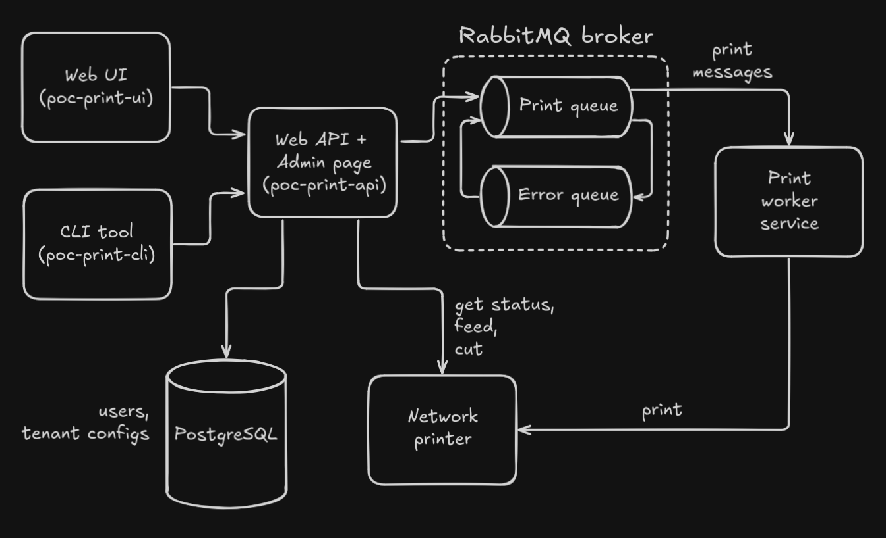
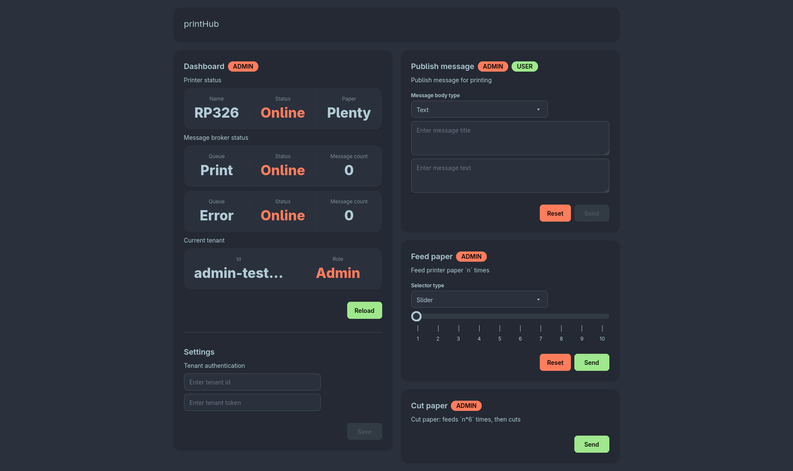

# poc_print_hub

Simple, yet robust selfhosted solution for delivering messages / notifications via a network printer. Intended primary use is, but not limited to, serving as a notification sink for a homelab infrastructure, recieving and printing notifications in the privacy of a local network.



## poc-print-api

Web-API + Admin page, enables print message publishing / processing, tenant authentication, as well as printer communication via the network and printer functions control (get status, feed paper, cut paper, etc.).

### Endpoints

| Verb | Url | Allowed Tenant Roles | Notes |
|---|---|---|---|
| `POST` | `api/queues/publish` | ADMIN, USER | Publishes messages for printing |
| `POST` | `api/queues/republish` | ADMIN | Republishes all messages from `error` to `print` queue |
| `GET` | `api/queues/status` | ADMIN | Returns `print` and `error` queue statuses: `isOnline`, `count` |
| `GET` | `api/printer/status` | ADMIN | Returns printer status: `name`, `isOnline`, `paperStatus` |
| `POST` | `api/printer/feed` | ADMIN | Feeds printer paper `n_times` |
| `POST` | `api/printer/cut` | ADMIN | Cuts paper (feeds `n*6` times, then cuts) |
| `POST` | `api/tenant/role` | ADMIN, USER | Returns tenant role: `tenantId`, `role` |

Request examples [here](src/api/pocprintapi_queries/queries.md). Make sure to create test tenant entries before using the queries (best done via the `Admin` page, instructions below):

| Tenant Id | Tenant Token | Role |
|---|---|---|
| `admin-test-id` | `admin-test-token` | ADMIN |
| `user-test-id` | `user-test-token` | USER |

### Tech stack

- [Django 5](https://docs.djangoproject.com/en/6.0/releases/5.0/)
- [Celery](https://docs.celeryq.dev/en/v5.5.3/django/first-steps-with-django.html) + [Celery Beat](https://docs.celeryq.dev/en/main/userguide/periodic-tasks.html) for task scheduling
- [WhiteNoise](https://whitenoise.readthedocs.io/en/stable/django.html) for static file serving
- [Gunicorn](https://gunicorn.org/) as WSGI server
- [PostgreSQL](https://www.postgresql.org/docs/)
- [RabbitMQ](https://www.rabbitmq.com/docs)

### Configuration

#### Environment variables

| Name | Default Value | Notes |
|---|---|---|
| SECRET_KEY | `by-using-default-secrets-I-am-running-away-from-my-responsibilities-and-it-feels-good` | `string` Make sure to generate your own, instructions below |
| DEBUG | `False` | `bool` |
| POC_PRINT_HUB_TENANT_AUTH_ENABLED | `True` | `bool` If enabled, consider setting up a super user for convinience. Instructions on that and how to use the auth below |
| POC_PRINT_HUB_RABBIT_MQ_HOST | - | `string` |
| POC_PRINT_HUB_RABBIT_MQ_USERNAME | - | `string` |
| POC_PRINT_HUB_RABBIT_MQ_PASSWORD | - | `string` |
| POC_PRINT_HUB_RABBIT_MQ_QUEUE_NAME | `poc_print_hub` | `string` |
| POC_PRINT_HUB_RABBIT_MQ_QUEUE_DURABLE | `True` | `bool` |
| POC_PRINT_HUB_RABBIT_MQ_QUEUE_BATCH_SIZE | `10` | `int` |
| POC_PRINT_HUB_RABBIT_MQ_DEAD_QUEUE_NAME | `poc_print_hub_dead_letter` | `string` |
| POC_PRINT_HUB_RABBIT_MQ_DEAD_QUEUE_DURABLE | `True` | `bool` |
| POC_PRINT_HUB_QUEUE_SCHEDULE_SEC | `5.0` | `float` |
| POC_PRINT_HUB_QUEUE_MAX_RETRIES | `3` | `int` |
| POC_PRINT_HUB_QUEUE_RETRY_DELAY_SEC | `3` | `int` |
| POC_PRINT_HUB_QUEUE_TIME_LIMIT_SEC | `300` | `int` |
| POC_PRINT_HUB_PRINTER_HOST | - | `string` |
| POC_PRINT_HUB_PRINTER_MESSAGE_SEPARATOR | `----------` | `string` Defines a piece of text that separates messages on paper |
| POC_PRINT_HUB_PRINTER_CHECK_PAPER_STATUS | `True` | `bool` If enabled, printer paper status is taken into account when checking if printer has adequate amount of paper available before printing. Otherwise, messages will be sent to be printed no matter the paper status |
| ALLOWED_HOSTS | `localhost` | `string` Comma separated list (e.g., `IP1,IP2`). If hosted not on `localhost`, make sure to include your server IP (use `127.0.0.1` + optionally, your server IP for Docker hosting) |
| CORS_ALLOWED_ORIGINS | `http://localhost:4200` | `string` Comma separated list (e.g., `IP1,IP2`). `http://localhost:4200` is default `poc-print-ui` IP and port. If hosted not on `localhost`, make sure to include your IP |

#### How to generate a custom SECRET_KEY value

Code:

```python
import os
import base64

new_key = base64.urlsafe_b64encode(os.urandom(64))
print(new_key)
```

Python shell:

```shell
python -c "import os; import base64; new_key = base64.urlsafe_b64encode(os.urandom(64)); print(new_key)"
```

## poc-print-ui



### Tech stack

- [Angular 20](https://v20.angular.dev/overview#develop-applications-faster-than-ever)
- [DaisyUI](https://daisyui.com/docs/intro/) / [Tailwind CSS](https://tailwindcss.com/docs/installation/using-vite)
- [Nginx](https://nginx.org/en/docs/)

### Configuration

#### Environment variables

| Name | Default Value | Notes |
|---|---|---|
| ENV_PROD | - | Should be `true` for Docker hosting |
| ENV_API_URL | - | `http://127.0.0.1:8000/api` for running locally |
| ENV_TENANT_ID_HEADER | - | Has to be `Pph-Tenant-Id` |
| ENV_TENANT_TOKEN_HEADER | - | Has to be `Pph-Tenant-Token` |
| ENV_MESSAGE_ORIGIN_NAME | - | Defines message origin that is going to be presented as part of printed messages. For example, `print-hub-web-ui` |

## poc-print-cli

```python
raise NotImplementedException("Coming soon...")
```